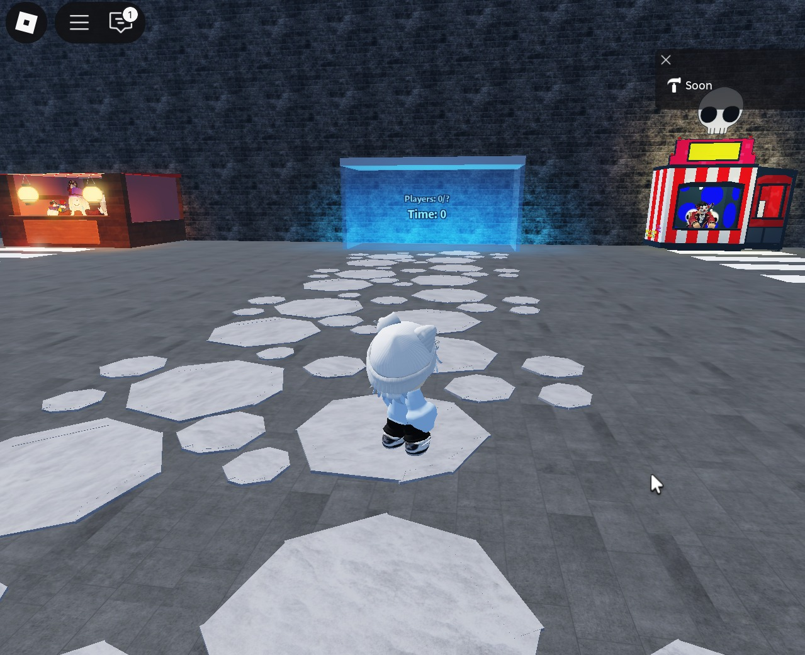
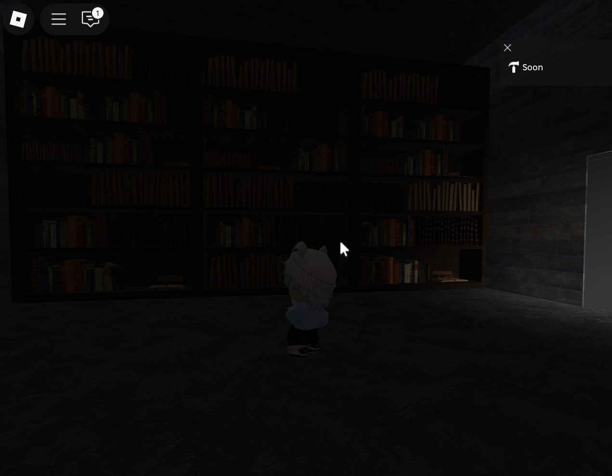
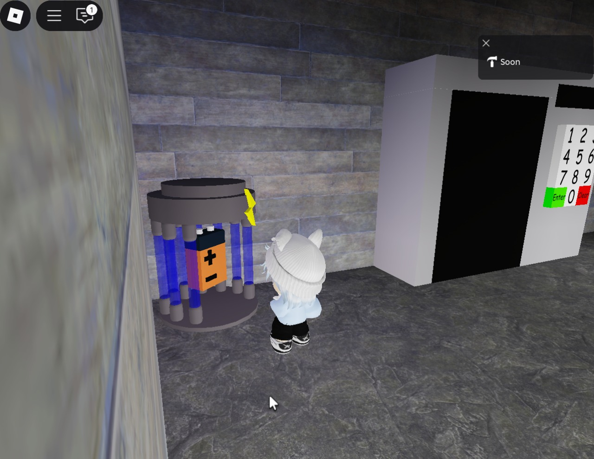
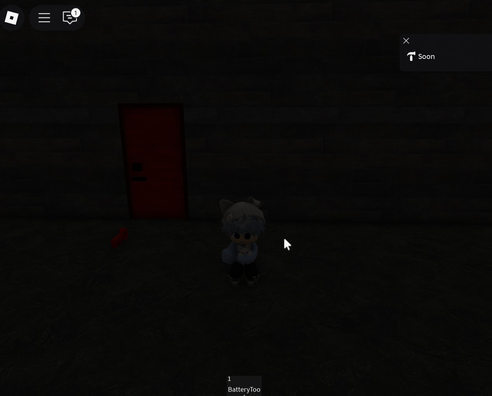

# 🧙‍♀️ Escape de las Brujas – Juego en Roblox

Este es un juego multijugador desarrollado en **Roblox Studio**.  
Los jugadores inician en un **lobby**, desde donde son teletransportados a la **mansión**, el mapa principal lleno de trampas, objetos y retos para escapar de las brujas.  

---

## 🚀 Archivos del juego
- `lobby.rbxlx` → archivo fuente del lobby.  
- `mansion.rbxlx` → archivo fuente del mapa principal.  

---

## 🎮 Cómo jugar
1. Únete al lobby para esperar a más jugadores.  
2. Una vez listo el grupo, serás teletransportado a la mansión.  
3. Como **Niño**, trabaja en equipo para encontrar llaves, objetos y reparar el carro de escape.  
4. Como **Bruja**, coloca trampas y persigue a los niños hasta atraparlos antes de que acabe el tiempo.  

---

## 📸 Capturas del juego

### Lobby

### Puerta secreta

### Interacción

### Puerta

---

## 🔗 Enlace en Roblox
Puedes jugarlo directamente en Roblox aquí:  
👉 [Jugar en Roblox](https://www.roblox.com/games/8630118475)  
